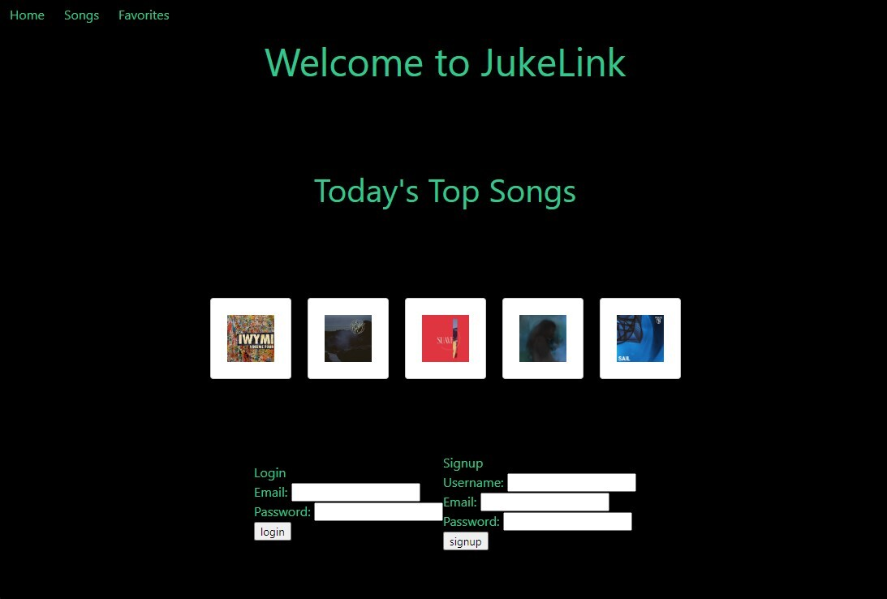

## JukeLink - Group 3 Project 2
This project was developed by Group 3 for Project 2. 
Andrew Joo [https://github.com/ANJ-23](https://github.com/ANJ-23) 
Belane Belayhun [https://github.com/belaneb](https://github.com/belaneb) 
Patrick Morris [https://github.com/morrispg](https://github.com/morrispg) 
& Amy Kilgour [https://github.com/kilgette](https://github.com/kilgette)

# Usage 
To use this application, visit the production version [https://music-favorites.herokuapp.com/](https://music-favorites.herokuapp.com/) on your browser. 

# Objective
The objective of this project was to fulfill the criteria of Project 2, which included utilizing a database with three associated tables, implementing a signup and login form with hashed password security, and restricting access to one or more pages to logged-in users. The project also required the implementation of GET and POST functionality. 

# Description
JukeLink is a web app featuring a collection of our group's favorite coding tunes. Users can create an account and log in to access a curated dashboard of lofi tunes. They can save their favorite songs to their account.

# Technologies
The application was developed using the following technologies:

* HTML
* CSS
* JavaScript
* jQuery
* SQL
* Sequelize
* Express
* Bulma

# Features
JukeLink includes the following features:

* Signup and login forms
* Song favorites functionality
* Restricted access to favorites and dashboard pages to logged-in users 

# Future Development 
Future developments for JukeLink include:

* API integration
* Dynamic album cover functionality
* Sign out and remove song from favorites features
* Categorization of songs by mood or type
* Implementation of a paid subscription model

# Learning Experience 
During the development of this project, our team learned the importance of git version control and clear, frequent communication to delegate tasks. We utilized Agile methodologies and a Kanban board to work more efficiently. Additionally, we gained experience with MVC file structure, MySQL, seed files, GET and POST functions, as well as Heroku deployment.